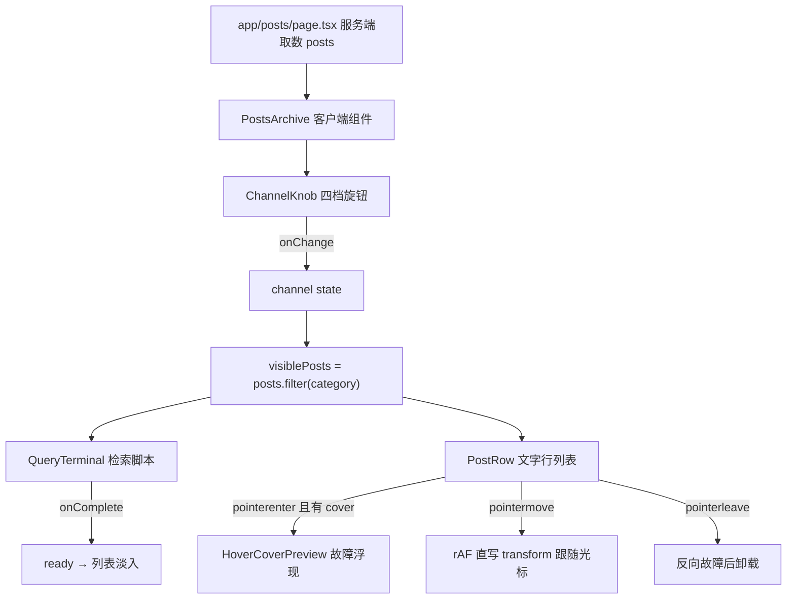

## 用户需求

在项目现有「千禧年控制台」架构上新增文章列表页面 `/posts`，形态与交互要求如下（含本轮追加的确认项，覆盖原卡片方案）：

- 展示全部文章的完整列表，**不使用卡片**，改用终端索引式文字列表（期号 + 标题 + 摘要 + 元信息）
- 按分类筛选：沿用现有四档旋钮（全部 / 技术 / 设计 / 生活），支持点击、拖动指针与键盘操作；默认「全部」，筛选结果以文字告知，实时更新列表
- 有 Hero 图的文章：鼠标悬浮到该行时以**故障效果**浮现图片，图片**跟随鼠标移动**；鼠标离开该行时以故障效果消失
- 无 Hero 图的文章：仅保留文字态的高亮反馈，作为对照
- 分类数据与文章数据正确关联（`post.category`），兼顾移动端与桌面端响应式布局

## 产品概述

NEON / NOTES 是千禧年控制台主题的个人信号站博客，现有首页 `/`、组件展台 `/components`、文章详情 `/posts/[slug]`。本次补齐归档列表页 `/posts`，以「文字索引 + 光标悬浮故障预览」的形态呈现全部文章，并从站点导航与详情页返回链接接入浏览动线。

## 核心功能

- 文章档案页 `/posts`：等宽期号 `POST_00X.LOG` + 中文标题 + 摘要 + 分类/日期/阅读时长/DEMO 元信息的文字行，整行链接至详情页
- 旋钮筛选：复用 `ChannelKnob` 四档，切换后按分类实时过滤，经检索终端门控后列表淡入
- 悬浮故障预览：仅有封面的行启用；进入时故障分片浮现、跟随光标、离开时故障消散
- 降级策略：触摸/粗指针设备不显示悬浮图，仅为纯文字列表；减少动态效果时关闭故障与跟随手补间
- 导航接入：`SiteHeader` 新增「文章列表」链接，详情页返回链接指向 `/posts`
- 响应式：桌面三栏行、平板收紧、移动端堆叠，320px 起无横向溢出

## 本轮确认的决策

| 项 | 结论 |
| --- | --- |
| 图片素材 | 先使用**占位图**（本地原创 SVG），真实运行阶段再替换为真实图片；不外链、不生成外部素材 |
| 配图范围 | 3 篇有封面（signal-001/002/003），1 篇无封面（signal-004）作对照态 |
| 触摸设备 | 不显示悬浮图，降级为纯文字列表 |
| 数据字段 | `PostSummary` 新增可选 `cover?: { src, alt }`，不影响首页卡片等现有消费者 |


## 技术栈

沿用项目现有栈，不引入新依赖：

- Next.js App Router + React + TypeScript
- **CSS Modules + `app/globals.css` 原生 CSS 变量**（项目规范明确**不使用 Tailwind CSS**，本方案遵循该约束）
- 图片：本地 `public/covers/*.svg` 原创占位封面，零外链、零网络请求

## 实现方案

### 整体策略

新建 `/posts` 路由，服务端组件取数 + 客户端组件承载交互（与首页 `app/page.tsx` → `HomeConsole` 的分层一致）。列表不用 `ArticleCard`，新建文字行组件与悬浮预览层；筛选、门控、故障动效全部复用现有实现与配色语言。

### 关键技术决策

1. **列表形态 = 文字行**
行结构：`POST_00X.LOG`（等宽期号）→ 标题（中文无衬线，18px/600）→ 摘要（16px，克制排版）→ 元信息（分类 · 日期 · 阅读时长 · DEMO）→ 行尾箭头。行间以细分隔线 + 银铬描边分隔，行悬停时标题做黄紫色差抖动（复用 `ArticleCard.module.css` 已有的 `@keyframes textGlitch` 语言），不使用 Win98 卡片盒，避免与首页卡片视觉重复。

2. **悬浮故障预览（核心新增）**

- 触发：行 `pointerenter`（仅在 `post.cover` 存在且指针为 fine pointer 时）
- 浮现：`clip-path` 横条分片错位 + 扫描线闪动 + 黄/紫双向色差，由 `opacity 0 → 1` 分帧进入（约 240–320ms），与现有 `glitchFlash` 同一配色（`#f4ed18` / `#8244c7`）
- 跟随：`pointermove` 中**用 rAF 直写 DOM 的 `transform: translate3d()`**，不触发 React 重渲染（沿用项目毫秒时钟、`PixelField` 的既有性能惯例）；带轻微阻尼与偏移，图片不遮挡当前行标题
- 消失：`pointerleave` 播放反向故障后卸载预览层
- 层级：`position: fixed`、`pointer-events: none`、`aria-hidden="true"`，层级变量在 `app/globals.css` 定义（现有 `--z-header: 40` / `--z-transition: 60`，预览层取低于转场、高于内容的值），挂载到页面级容器避免被父级 `overflow` 裁剪
- 单一实例：全页只维护一个预览层节点，切换行时切换内容与位置，避免多节点开销

3. **能力检测与降级**

- JS 检测 `matchMedia("(hover: hover) and (pointer: fine)")`，配合 CSS `@media (hover: none), (pointer: coarse)` 隐藏预览层 → 触摸设备为纯文字列表
- `prefers-reduced-motion: reduce`：不做故障分片与跟随补间（瞬显瞬消或不显示预览），文字内容始终完整可读
- 键盘：`focus-visible` 时行有明确可见高亮；有封面的行在键盘聚焦时不依赖悬浮图传达信息（重要信息必须有文字）

4. **数据层最小改动**
`PostSummary` 新增 `cover?: { src: string; alt: string }`（可选），3 篇填充 `/covers/*.svg`，1 篇留空。字段与路径设计成「把 `src` 换成真实图片路径即可」，为后续 CMS 阶段预留。首页 `ArticleCard` 等现有消费者零改动。

5. **筛选与门控复用**

- `scriptFor(channel)` / `scriptKey` 从 `HomeConsole.tsx` L15-20 **提取为共享导出**（放 `components/QueryTerminal.tsx` 或 `lib/`），首页与列表页共用，复用 `hasQueryPlayed` 跨页缓存（从详情页返回时列表立即可见）
- 列表页复用 `homeConsole` 已验证模式：`channel` / `ready` 双 `useState`，`handleChannelChange` 用 `hasQueryPlayed(scriptKey(next))` 决定是否跳过动画；`QueryTerminal` 的 `onComplete` → `data-ready` → 列表淡入
- 状态读数行以文字显示「当前频道 X / 检索结果 NN 条 · 演示内容」，满足「结果须以文字告知」

### 性能与可靠性

- 过滤为 O(n)（4 条演示数据），无瓶颈；预览层单例 + rAF 直写，避免每次 `pointermove` 触发 React 渲染
- 预览图片按需加载、离开即卸载；首屏不因预览层增加额外网络请求
- 无新增环境变量、不改存储层；空结果防御：某分类无文章显示终端风格 `0 records` 占位文字

## 实施注意事项

- 写 `app/posts/page.tsx`（App Router `metadata` 导出）前先查阅 `node_modules/next/dist/docs/` 中的 App Router 说明（AGENTS.md 提示本版本可能有破坏性变更）
- 改动范围：新增 `app/posts/page.tsx`、`components/PostsArchive.tsx`（+ module.css）、`components/PostRow.tsx`（+ module.css）、`components/HoverCoverPreview.tsx`（+ module.css）、`public/covers/*.svg`；修改 `lib/posts.ts`、`components/SiteHeader.tsx`、`components/HomeConsole.tsx`（改引共享 scriptFor，行为不变）、`app/posts/[slug]/page.tsx`（返回链接 → `/posts`）、`app/components/page.tsx`（展台同步展示）、`app/globals.css`（层级变量）、`changlog.md`
- 保持「外壳 / 功能窗口 / 文章内容」的边框轻重关系，不把同一种金属边框套到所有区块；不加红色
- 验收：`npm run typecheck` 与 `npm run build` 通过；检查 320px / 375px / 平板 / 桌面、`prefers-reduced-motion`、键盘焦点与触摸降级

## 架构与数据流



## 目录结构

```
c:/dev/oldtech/
├── app/
│   ├── posts/
│   │   ├── page.tsx                 # [NEW] 服务端组件：导入 posts，导出 metadata，渲染 PostsArchive
│   │   └── [slug]/page.tsx          # [MODIFY] 返回链接 /#journal → /posts
│   └── components/page.tsx          # [MODIFY] 展台新增「文字行 + 悬浮故障预览」示例区
├── components/
│   ├── PostsArchive.tsx             # [NEW] 客户端：channel/ready 双状态、旋钮、终端门控、文字行列表、空态
│   ├── PostsArchive.module.css      # [NEW] 页面分区与 data-ready 淡入、响应式断点
│   ├── PostRow.tsx                  # [NEW] 单行：期号/标题/摘要/元信息，整行 Link，支持无封面态
│   ├── PostRow.module.css           # [NEW] 行悬停故障高亮、focus-visible、≤680px 堆叠
│   ├── HoverCoverPreview.tsx        # [NEW] 单例悬浮预览层：故障进出场 + rAF 跟随光标 + 能力/降级检测
│   ├── HoverCoverPreview.module.css # [NEW] clip-path 分片、扫描线、色差关键帧
│   ├── SiteHeader.tsx               # [MODIFY] nav 新增 /posts 链接并顺延编号
│   ├── HomeConsole.tsx              # [MODIFY] 改用共享 scriptFor/scriptKey，行为不变
│   └── QueryTerminal.tsx            # [MODIFY] 导出共享 scriptFor/scriptKey
├── lib/posts.ts                     # [MODIFY] PostSummary 新增可选 cover?: { src, alt }；3 篇填充占位封面
├── public/covers/                   # [NEW] 3 个原创 SVG 占位封面（深紫+亮黄+银铬，含期号构图）
├── app/globals.css                  # [MODIFY] 新增悬浮预览层 z-index 变量
└── changlog.md                      # [MODIFY] 记录新页面、文字列表形态、占位封面与降级策略
```

## 关键代码结构

```ts
// lib/posts.ts —— 新增可选字段，现有消费者零改动
export interface PostSummary {
  id: string; slug: string; title: string; excerpt: string;
  category: PostCategory; publishedAt: string; readingMinutes: number;
  issue: string; featured?: boolean; isDemo?: boolean;
  cover?: { src: string; alt: string }; // [NEW] 占位 SVG，后续替换为真实图片
}

// components/HoverCoverPreview.tsx —— 预览层对外契约
export interface HoverCoverPreviewHandle {
  show(cover: { src: string; alt: string }, x: number, y: number): void;
  move(x: number, y: number): void;
  hide(): void;
}
```

## Agent Extensions

### SubAgent

- **code-explorer**
- 用途：实施前核对 `HomeConsole.tsx` L15-20 的 `scriptFor/scriptKey` 抽取点、`SiteHeader.tsx` 导航、`app/posts/[slug]/page.tsx` 返回链接、`app/globals.css` 的 z-index 与断点变量、`components/page.tsx` 展台分区结构，以及 `node_modules/next/dist/docs/` 中 App Router 路由与 `metadata` 约定
- 预期结果：拿到精确行号与片段，确保抽取共享工具、新增路由与层级变量时不引入行为回归

## 设计风格

严格继承项目既有的「千禧年控制台」体系（深紫 + 亮黄 + 银铬、Win98 窗口语言、终端检索、实体旋钮），不做新视觉探索；样式用 CSS Modules + `app/globals.css` 变量，不使用 Tailwind（项目规范明确禁止，且现有页面均为 CSS Modules）。

## 页面结构（/posts）

- **页面头部**：面板编号 + 大标题「文章档案 ARCHIVE」+ 等宽副标题，标注演示内容，沿用分区窗口的铬边框语言
- **频道控制区**：`RetroWindow`（`CHANNEL_CTRL.EXE`）内嵌 `ChannelKnob compact` 四档旋钮，状态读数行以文字显示当前频道与结果条数
- **检索终端**：`QueryTerminal` 逐行打出 `open archive.db → query --channel=… → hydrate rows`，完成后列表淡入；已播放频道直接呈现完成态
- **文章索引列表**：等宽期号列 + 标题/摘要列 + 元信息列的三栏文字行，细分隔线与银铬描边；悬停时标题黄紫色差抖动、行底亮黄细线扫过；有封面的行在光标处故障浮现预览图并跟随移动，离开时故障消散；无封面的行仅文字高亮
- **页脚**：沿用全站终端化页脚，无需改动

## 响应式与可用性

桌面三栏单行；≤1100px 收紧间距与摘要行数；≤680px 堆叠为期号行 + 标题 + 摘要 + 元信息两行结构，并隐藏悬浮预览（触摸降级）；320px 起无横向溢出；键盘 `focus-visible` 有明确可见高亮；减少动态效果时故障与跟随补间关闭、内容直接可读。

## Agent Extensions

### SubAgent

- **code-explorer**
- Purpose：核对 `HomeConsole.tsx` 的 `scriptFor/scriptKey`、`SiteHeader.tsx` 导航、`app/posts/[slug]/page.tsx` 返回链接、`app/globals.css` 的层级与断点变量、组件展台分区结构，以及 `node_modules/next/dist/docs/` 的 App Router 约定
- Expected outcome：输出精确行号与片段，保证共享工具抽取、新路由与新增层级变量不引入回归