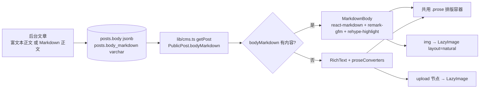

## 产品概述

为博客文章正文增加 **Markdown 写作与迁移能力**：新增 Markdown 正文字段，与现有 Lexical 富文本正文二选一，前台自动判断渲染哪一种。这样从 Typecho 迁移时，导出的 Markdown 原文可以直接粘贴使用，`` 也天然支持外链图片。

## 核心功能

- 后台文章编辑新增「Markdown 正文」输入区，与富文本正文并存；两者只填一种即可保存，都为空时给出中文校验提示
- 前台渲染优先级：Markdown 正文有内容时渲染 Markdown，否则渲染原有富文本正文；已发布的老文章不受影响
- Markdown 渲染范围：标题、粗斜体、链接、图片、引用、有序/无序列表、任务列表、表格、删除线、分隔线、行内代码与代码块（基础 + GFM）
- 代码块按语言语法高亮，配色沿用站点信号黄 / EVA 紫 / 银铬体系（不使用红色）
- Markdown 中的图片走站内统一懒加载组件：代码式占位符、限宽在正文内容宽度内、保持原始比例、加载完成直接出现（无故障动画）；外链图片请求不带来源页，降低防盗链拦截
- 外链与站内链接行为区分：站内链接保持无刷新跳转（PJAX 接管），外部链接新窗口打开并带安全属性
- 阅读时长与摘要自动计算同时支持两种正文来源：Markdown 文章按正文纯文本长度计算，摘要留空时自动截取
- 组件展台新增 Markdown 正文渲染示例，便于与既有排版对照

## 使用方式（交付后）

后台文章编辑器 → 在「Markdown 正文」中粘贴 Markdown 原文（如 Typecho 导出内容）→ 保存或发布。前台详情页正文区即按 Markdown 渲染。原有富文本正文的插入方式与展示均保持不变。

## 技术栈选择

- 框架与语言：沿用项目现状 —— Next.js 16.3.6 App Router、React 19.3.0、TypeScript 5.9、CSS Modules（项目明确不使用 Tailwind）
- CMS 与数据库：Payload CMS 3.90.2、@payloadcms/richtext-lexical 3.90.2、PostgreSQL（`push: false`，结构仅由 `migrations/` 维护）
- 新增依赖：`react-markdown`、`remark-gfm`、`rehype-highlight`（内置 lowlight 常用语法集，无需额外语言包）
- 渲染位置：Markdown 渲染组件为**服务端组件**，不引入客户端包体积；仅其中的图片复用既有客户端组件 `LazyImage`
- 迁移工具：`npx payload migrate:create`（生成 SQL 迁移 + 全量 schema 快照 + 索引注册）、`npm run db:migrate`、`npx payload generate:types`

## 实现思路

核心策略是**双正文来源 + 前台优先级渲染**，数据库只增列、不动既有列：

1. **数据模型**：`posts.body`（richText）改为可选，新增 `bodyMarkdown`（textarea → varchar）。已核实 `posts.body` 与 `_posts_v.version_body` 在数据库中本就是**可空 jsonb**（`migrations/20260927_123104_initial_blog.ts:72、:91`），因此改 `required` 不产生列变更，迁移只需新增 `posts.body_markdown` 与 `_posts_v.version_body_markdown` 两列。
2. **自动派生**：Posts 的 `beforeValidate` 钩子当前用 `richTextToPlainText(body)` 计算 `readingMinutes` 与自动摘要（`payload.config.ts:78-86`）。扩展为：优先取 `bodyMarkdown` 的纯文本（先剥离 Markdown 语法标记），否则回退既有逻辑；并增加「至少填写一种正文」的字段级校验（`validate(value, { siblingData })`）。
3. **前台渲染**：新增 `components/MarkdownBody.tsx`（`react-markdown` + `remark-gfm` + `rehype-highlight`），详情页在 `detail.bodyMarkdown` 非空时渲染它，否则保留现有 `<RichText data={detail.body} converters={proseConverters} />`。两者共用同一个 `.prose` 容器与既有排版样式。
4. **图片统一**：`react-markdown` 的 `img` 组件映射到既有 `LazyImage`，并为其新增 `layout="natural"` 模式——外链/Markdown 图片无法预知宽高，现有包装层内部 img 为绝对定位填充，缺宽高时容器高度会塌陷为 0；natural 模式下 img 回到文档流按自然尺寸渲染（居中、`max-width:100%`），容器给最小高度以容纳代码占位符。
5. **代码高亮主题**：`rehype-highlight` 输出 `hljs-*` 全局类名。在 `app/globals.css` 中以 `.prose` 作用域编写一套站点色彩的高亮主题（关键字/字符串/数字用信号黄，函数/变量用紫与银铬，注释用 `--muted`），并覆盖为透明背景以适配既有 `pre` 凹陷终端样式；不使用红色。

### 关键决策与理由

- **不与 Lexical 做双向转换**：双向转换必然出现格式丢失，且 Typecho 迁移追求原文保真；并列字段最稳、可回退。
- **迁移必须由 `migrate:create` 生成**：已核实每个迁移都带 2000 行以上的全量 schema 快照 json（如 `migrations/20260927_131835_add_profile_avatar.json:2184` 行），手写 SQL 会让后续 diff 失真，因此以命令生成并把生成文件提交。
- **不启用 `rehype-raw`**：`react-markdown` 默认转义原始 HTML 并过滤 `javascript:` 协议，保持默认即避免 XSS；正文只有管理员可编辑，无需放开 HTML。
- **`rehype-highlight` 传 `ignoreMissing: true`**：遇到未收录语言时降级为纯代码块，而不是抛错导致渲染失败。
- **样式复用而非新造**：`.prose` 已覆盖 h2-h4、blockquote、code/pre、列表、链接、分割线、表格、`.proseImage`（`app/(frontend)/posts/[slug]/page.module.css:21-52`），Markdown 输出直接受益，避免两套阅读排版。

### 性能与可靠性

- MarkdownBody 在服务端渲染，无客户端解析开销；`react-markdown` 生态体积只增加服务端构建产物。
- Markdown 图片沿用原生 `loading="lazy"` 与 `referrerPolicy="no-referrer"`；`layout="natural"` 仅一个类名与少量 CSS，无运行时开销。
- 纯文本派生（阅读时长/摘要）为一次性字符串处理，复杂度 O(n)，无额外查询。
- 失败与边界：Markdown 为空回退富文本；两者皆空由校验拦截；非法图片地址不渲染；未收录语言降级为普通代码块。

## 实现注意

- 前台优先级只依据 `bodyMarkdown` 是否有非空内容，不引入第三个开关字段，避免状态组合膨胀。
- `LazyImage` 新属性必须可选且默认行为不变，调用方目前在用 8 处（首页精选、卡片封面、详情封面、正文上传插图、悬浮预览、友链图标、站长头像、组件展台），不得引入回归。
- `natural` 模式下不得给 img 加绝对定位；占位符仍为绝对定位并置于 img 之下。
- Markdown 文章的 `pullQuote` 字段保留可用（额外引文块），与 Markdown 自身的引用语法不冲突。
- 生产流程一致性：迁移文件与 `payload-types.ts` 生成结果需一并提交；不要手工编辑 `migrations/*.json`。
- 完成后同步组件展台与 `changlog.md`，并运行 `npm run typecheck`（用户此前取消过 `npm run build`，不主动运行）。

## 架构设计



## 目录结构

```
oldtech/
├── payload.config.ts                                # [MODIFY] 新增 markdownToPlainText 纯文本化助手；Posts.body 去掉 required；新增 bodyMarkdown 字段（textarea，字段级校验收 siblingData：两种正文不可同时为空）；beforeValidate 改为从 bodyMarkdown 或富文本派生 readingMinutes 与自动摘要
├── migrations/
│   ├── <timestamp>_add_markdown_body.ts             # [NEW] 由 npx payload migrate:create 生成：为 posts 增加 body_markdown，为 _posts_v 增加 version_body_markdown（varchar，可空），down 中删除
│   ├── <timestamp>_add_markdown_body.json           # [NEW] 由命令生成的 schema 快照，禁止手工编辑
│   └── index.ts                                     # [MODIFY] 由命令自动追加本次迁移注册（如未自动追加则手工补一行）
├── payload-types.ts                                 # [MODIFY] npx payload generate:types 刷新，Posts 接口新增 bodyMarkdown
├── lib/
│   └── cms.ts                                       # [MODIFY] CmsPost 增加 bodyMarkdown；PublicPost 增加 bodyMarkdown: string；getPost 映射 post.bodyMarkdown || ''
├── components/
│   ├── MarkdownBody.tsx                             # [NEW] 服务端组件：react-markdown(src=source) + remark-gfm + rehype-highlight({ignoreMissing:true})；components 映射 img → LazyImage(layout="natural"、effect="none"、referrerPolicy="no-referrer"、className=proseImage)，a → 站内保持普通 a（交由 PJAX）／外链 target="_blank" rel="noopener noreferrer"；不支持 HTML 直出（不引入 rehype-raw）
│   ├── LazyImage.tsx                                # [MODIFY] 新增可选 layout?: "fill" | "natural"（默认 fill，行为不变）；natural 时输出 data-layout 且不生成 aspect-ratio 内联样式
│   └── LazyImage.module.css                         # [MODIFY] 新增 .lazy[data-layout="natural"] 规则：容器最小高度（占位符可见）、img 回到文档流 position:relative、z-index 1、width:auto、max-width:100%、height:auto、margin:0 auto
├── app/
│   ├── globals.css                                  # [MODIFY] 新增 .prose 作用域的 hljs 高亮主题（关键字/字符串/数字=信号黄，函数/类型=紫，注释=muted，背景透明），复用既有 CSS 变量，不使用红色
│   └── (frontend)/
│       ├── posts/[slug]/page.tsx                    # [MODIFY] 正文区按 detail.bodyMarkdown 非空渲染 <MarkdownBody source={...} />，否则保留 <RichText />
│       ├── posts/[slug]/page.module.css             # [MODIFY] 如 Markdown 输出需要微调（表格横向滚动容器、代码块语言标签等）在此补充，保持与既有 .prose 一致
│       └── components/page.tsx                      # [MODIFY] 新增一个 Markdown 正文示例区，展示标题/引用/表格/任务列表/高亮代码块，取本地演示内容
├── README.md                                        # [MODIFY] 内容流程说明补充：正文支持富文本或 Markdown 二选一，Markdown 优先；迁移与类型生成命令
└── changlog.md                                      # [MODIFY] 顶部追加条目：Markdown 正文支持、渲染范围、图片与代码高亮表现、Typecho 迁移方式
```

## 关键代码结构

字段定义（`payload.config.ts`）：

```ts
{ name: 'body', type: 'richText' },                                   // 由 required 改为可选
{ name: 'bodyMarkdown', label: 'Markdown 正文', type: 'textarea',    // 新增，varchar 可空
  admin: { description: '与富文本正文二选一；填写后前台优先渲染 Markdown（支持 GFM 表格、任务列表与代码高亮，图片用 ）。' } }
```

渲染组件签名（`components/MarkdownBody.tsx`）：

```
export function MarkdownBody({ source }: { source: string }): React.ReactNode;
```

`LazyImage` 扩展（仅新增可选属性，兼容既有 8 处调用）：

```ts
type LazyImageProps = {
  /* 现有属性均不变 */
  layout?: "fill" | "natural";   // 默认 "fill"：绝对定位填充父容器；"natural"：文档流自然高度
};
```

## Agent Extensions

### Skill

- **playwright-cli**
- Purpose: 在实施完成后驱动浏览器验证 Markdown 正文渲染：打开一篇使用 Markdown 的文章，检查标题层级、引用、表格、任务列表、代码高亮配色与图片懒加载占位符，并截取不同宽度（桌面 / 320px 起）的页面截图确认无横向溢出、阅读区排版正常。
- Expected outcome: 得到可核对的页面截图与渲染结论，确认 Markdown 与既有 `.prose` 排版一致、代码高亮生效且未出现红色配色、外链图片按懒加载策略显示。
- **lsp-code-analysis**
- Purpose: 在改动 `lib/cms.ts` 的 `PublicPost`/`CmsPost` 与 `LazyImage` 属性前，做一次语义级影响面分析：查找 `body`、`PublicPost`、`LazyImage` 的定义与全部引用点，确保没有遗漏的消费方（首页、档案页、种子脚本、组件展台），避免给可选属性引入类型或行为回归。
- Expected outcome: 输出精确的引用清单；据此确认 `LazyImage` 新属性为可选且默认行为不变，`bodyMarkdown` 的读取点全部覆盖，`npm run typecheck` 一次通过。