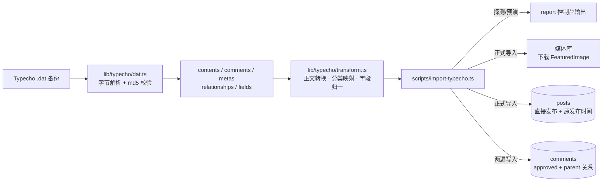

## 产品概述

为博客增加 **Typecho 老站迁移能力**：读取 Typecho 后台「备份」功能导出的 `.dat` 备份文件，把其中的文章、特色图片与评论导入本站，历史文章从此可以直接在新站继续写作与维护。

## 核心功能

- **解析 Typecho 备份**：`.dat` 是 Typecho 自定义二进制格式（不是 XML），需按官方字节格式解析文章、评论、分类关系与自定义字段
- **两种正文格式统一为 Markdown**：
  - 原本就是 Markdown 的文章：剥离 Typecho 的 Markdown 标记与 `<!--more-->` 摘要标记，原样保留
  - HTML 老文章（WordPress Gutenberg 区块）：清除 `<!-- wp:xxx -->` 注释与空段落，转换标题、段落、列表、引用、链接、加粗、表格等为 Markdown；`figure + img + figcaption` 转成「Markdown 图片 + 一行说明文字」
  - 自动判别正文类型，无需人工挑拣；转换异常的文章在报告中列出
- **特色图片作为封面**：读取自定义字段 `FeaturedImage` 中的图片地址，下载后上传到本站媒体库并关联为文章封面；下载失败的文章仍正常导入，仅在报告中标记
- **正文插图保持外链**：文中图片地址不改写，继续指向原站
- **评论导入并保留回复关系**：只导入已审核评论，`author / mail / url / 正文 / 时间` 一并迁移，父评论关系完整还原（多级回复在详情页按现有层级展示）
- **分类与期号映射**：Typecho 分类名映射到本站「技术 / 设计 / 生活」三个频道，支持自定义映射表；期号沿用旧文章 ID 便于回溯，冲突时自动避让
- **安全自检与预览**：提供结构探测模式（只看备份里有什么、不写数据库）与预演模式（跑完整转换、打印每篇文章与每条评论的导入结果但不落库），确认无误后再正式导入
- **幂等可重跑**：重复执行不会产生重复文章或重复评论，中断后可再次运行继续

## 交付后的使用方式

先用探测模式查看备份结构，再用预演模式核对转换结果，确认后正式导入；导入的文章直接发布并保留原始发布时间，评论按原有回复层级展示在文章详情页。整个过程在本地执行，不需要登录旧站。


## 技术栈选择

- 运行环境：沿用项目现状 —— Node.js 20+、TypeScript 5.9、Payload CMS 3.90.2 local API、PostgreSQL；导入脚本沿用现有 `payload run` 执行方式（参考 `package.json` 的 `seed:drafts`）
- 新增依赖（克制，仅两个）：`turndown`（HTML→Markdown）、`turndown-plugin-gfm`（表格/删除线/任务列表规则），开发期类型 `@types/turndown`
- 二进制解析：Node 内置 `Buffer` + `node:crypto`（md5 校验），不引入额外解析库
- 不涉及数据库结构变更，**不需要迁移**；`payload-types.ts` 无需重新生成

## 实现思路

### 1. Typecho 备份的字节格式（已查证 Typecho 官方源码，非推测）

来源：`var/Widget/Backup.php`（`export()` / `extractData()` / `buildBuffer()` / `processData()` / `parseHeader()`）与 `var/Typecho/Common.php`（`buildBackupBuffer()` / `extractBackupBuffer()`）。

文件结构：

```
[21 字节头标记] [记录块 1] [记录块 2] … [21 字节尾标记]
```

- 头尾标记相同：`%TYPECHO_BACKUP_XXXX%`（`%TYPECHO_BACKUP_` 16 字符 + 4 字符版本号 + `%`），校验正则 `/%TYPECHO_BACKUP_[A-Z0-9]{4}%/`，版本号取字符串第 16–19 位
- 记录块字节封装（`buildBackupBuffer`）：

```php
$buffer .= pack('vvV', $type, strlen($header), strlen($body)); // 2+2+4 字节，小端
$buffer .= $header . $body;   // header = json_encode(schema)，body = 各字段值无分隔符拼接
$buffer .= md5($buffer);      // 32 字节十六进制
```

- 读取侧两种版本（`extractBackupBuffer`）：
  - 版本为 `FILE`：meta **6 字节**（`unpack('v3')` → type / headerLen / bodyLen 各 2 字节小端），且 **body 长度以 schema 为准**（`array_reduce` 累加 schema 中非 null 的长度，因为正文可能超过 64KB）
  - 其他版本：meta **8 字节**（type 2B + headerLen 2B + bodyLen 4B，小端），body 长度按 meta 读取
  - md5 校验对象是 `meta + header + body`
- schema 为 JSON 对象：键=字段名、值=该字段字节长度（`null` 表示 NULL）；按 schema 的键顺序用 `substr` 依次切片还原记录
- **类型 ID**：`1=contents`、`2=comments`、`3=metas`、`4=relationships`、`5=users`、`6=fields`；其他 ID 交由插件处理，本工具忽略并提示
- 各表字段顺序（即 schema 顺序，来源 `applyFields()`）：`contents: cid,title,slug,created,modified,text,order,authorId,template,type,status,password,commentsNum,allowComment,allowPing,allowFeed,parent`；`comments: coid,cid,created,author,authorId,ownerId,mail,url,ip,agent,text,type,status,parent`；`metas: mid,name,slug,type,description,count,order,parent`；`relationships: cid,mid`；`fields: cid,name,type,str_value,int_value,float_value`
- 时间字段即普通字段：`contents.created/modified`、`comments.created`，单位 Unix 秒

### 2. 导入映射

| Typecho | 本站字段 | 处理方式 |
| --- | --- | --- |
| `contents.title` | `posts.title` | 直接使用 |
| `contents.slug` | `posts.slug` | 清洗为小写字母/数字/连字符；为空或清洗后为空则留空，交由现有自动 slug 钩子生成；冲突时回退为空（自动生成） |
| `contents.text` | `posts.bodyMarkdown` | Markdown 原样 / HTML 转 Markdown（见下） |
| `contents.created` | `posts.publishedAt` | Unix 秒 → ISO 字符串 |
| `contents.cid` | `posts.issue` | 零填充到至少 3 位（如 `042`）；与站内已有期号冲突时追加字母后缀并在报告中说明 |
| 分类关系 | `posts.category` | `relationships` + `metas(type=category)` 取分类名，经映射表落到 技术/设计/生活，未匹配归入默认频道 |
| `fields[FeaturedImage].str_value` | `posts.cover` | 下载 → 写入媒体库（`alt` 取文件名）→ 关联；失败则跳过封面并记录 |
| `comments.cid` | `comments.post` | 通过文章映射查找 |
| `comments.parent` | `comments.parent` | 两遍写入：先建全部评论得到 `coid → id` 映射，再回填父评论 |
| `comments.author / mail / url / text / created` | `comments.author / email / site / text / createdAt` | `author` 截断至 24 字符；`site` 仅接受 http/https；`text` 清洗 HTML 实体与标签、超 2000 字符截断并记录；尝试保留原始 `createdAt` |
| `comments.status` | 过滤 | 仅 `approved` 导入（用户选择） |

正文处理细节：

- 强信号：正文以 Typecho 的 Markdown 标记开头（`<!--markdown-->`）→ 直接按 Markdown 处理并剥离该标记
- 无标记时按启发式判别：出现 `<p`、`<h1-6`、`<figure`、`` 与 `<!-- /wp:* -->` 注释、空 `<p></p>`，交给 turndown + GFM 规则；自定义规则把 `<figure>` 转成 `` 加一行斜体说明，并去掉残留的 `wp-*` class 影响
- 统一清理正文开头/结尾的 `<!--more-->`、多余空行；转换失败（抛错或结果为空但原文有内容）的文章记录到报告并保留原始 HTML 片段供人工处理

### 3. 关键决策与理由

- **直接解析 `.dat` 而不是让用户导出 SQL**：用户已确认手上就是 `.dat`，且格式简单（定长 meta + 长度 schema + md5），无需引入数据库依赖
- **统一转 Markdown 而不是放行 HTML**：前台 MarkdownBody 刻意不放行原始 HTML（未启用 rehype-raw），转换方案能保持统一的阅读样式与安全边界；代价是 class/内联样式丢失，已与用户确认
- **只下载特色图片**：用户选择；正文插图保持外链可让首次迁移快速完成，且不会把旧站的全部图片都拖过来
- **只导入 `type=post` 且 `status=publish` 的文章**：页面（page）、附件、草稿、私密文章不进入新站，分类与数量在报告中列出，避免误发布
- **两遍写入评论**：父评论必须先存在才能建立关系，因此先建全部评论再回填 parent，避免深层回复丢链
- **不做事务性回滚**：Payload local API 不提供跨记录事务；改用幂等设计（按 slug / `(post, author, 正文前缀)` 查重跳过），中断后重跑即可续上
- **`--selftest` 自检**：内置一个按同样字节格式的编码器，现场合成包含两种版本 meta 的迷你备份，解析回来后逐字段断言——这样即使还没有真实备份文件，也能验证解析器正确

### 4. 性能与可靠性

- 备份文件为全量内存解析：数百篇文章 + 数千评论量级下（文件通常几 MB）耗时以毫秒计，无需流式处理
- 去重查询批量进行：一次 `payload.find({ where: { slug: { in: [...] } } })` 取回已有 slug，避免逐篇查询的 N+1
- 图片下载串行并带超时与大小上限（默认 15MB 拒绝超大文件），失败即跳过，不阻塞整体导入
- 长事务风险规避：逐篇创建，每篇完成后输出进度日志（`payload.logger`），中断可续跑
- 安全：只读备份文件、只写本站数据库；不修改或删除已有内容；`overrideAccess: true` 仅用于脚本内部写入，脚本不进入 Web 运行路径

## 架构设计



## 目录结构

```
oldtech/
├── package.json                                    # [MODIFY] 新增依赖 turndown / turndown-plugin-gfm（devDep 加 @types/turndown）；新增脚本 "import:typecho": "payload run scripts/import-typecho.ts"
├── lib/typecho/
│   ├── dat.ts                                      # [NEW] Typecho 备份解析器：校验 21 字节头尾标记与版本号；按版本读取 6 字节(FILE) 或 8 字节 meta；按 schema 长度切片还原记录；md5 校验；按类型 ID 1–6 分组输出；导出 parseBackup(buffer) 与仅用于自检的 encodeBackup(rows)
│   └── transform.ts                                # [NEW] 转换层：Gutenberg 注释与空段落清理、figure/figcaption → Markdown 图片+说明、Markdown/HTML 自动判别、<!--markdown--> 与 <!--more--> 处理、分类名 → 频道映射（含关键词表与自定义映射）、出题号/slug/日期归一、评论文本清洗与截断、封面 URL 提取
├── scripts/
│   └── import-typecho.ts                           # [NEW] CLI 主流程：--file / --inspect / --dry-run / --selftest / --category-map / --default-category；读取并解析备份；幂等查重；封面下载写入媒体库；文章发布写入；评论两遍写入保留 parent；尝试保留原始时间；输出统计报告（成功/跳过/失败清单与原因）
├── README.md                                       # [MODIFY] 新增「从 Typecho 迁移」章节：命令用法、三阶段（探测→预演→导入）、分类映射表配置、图片与评论策略、可重复执行说明
└── changlog.md                                     # [MODIFY] 顶部追加条目：Typecho .dat 导入能力、HTML→Markdown 转换、特色图片迁移、评论层级保留
```

## 关键代码结构

解析器对外接口（`lib/typecho/dat.ts`）：

```ts
export type BackupRow = Record<string, string | null>

export type ParsedBackup = {
  /** 头部 4 字符版本号，新版为 'FILE' */
  version: string
  contents: BackupRow[]
  comments: BackupRow[]
  metas: BackupRow[]
  relationships: BackupRow[]
  fields: BackupRow[]
  /** 非 1–6 的类型 ID（插件数据），仅提示不处理 */
  unsupportedTypes: number[]
}

/** 解析备份字节流；头尾标记、记录 md5 或长度不一致时抛出带上下文的错误 */
export function parseBackup(buffer: Buffer): ParsedBackup

/** 仅用于 --selftest：按同一字节格式合成备份，便于无真实文件时验证解析器 */
export function encodeBackup(records: { type: number; row: BackupRow }[], version?: string): Buffer
```

## 实现注意

- 必须按 schema 的键顺序切片，且 schema 值为 `null` 时该字段为 NULL 并跳过长度累加（`FILE` 版本的 body 长度完全依赖此累加，算错会导致后续记录全部错位）
- `FILE` 版本 meta 的 bodyLen 只有 2 字节，**不可作为真实长度使用**，一律以 schema 累加值为准
- 头尾标记一致性与每条记录的 md5 必须校验；失败时报出记录序号与类型，便于定位损坏文件
- 期号唯一约束会与站内已有的演示文章期号冲突，必须做「取不到就换一个」的避让而不是直接失败
- 正文为空、既有正文又无 Markdown 的文章会被 `beforeValidate` 钩子拒绝（「至少一种正文」），需要在导入前过滤并记录，不能让脚本中途崩溃
- 评论 `author` 超过 24 字符、`text` 超过 2000 字符、`site` 非 http/https 都会被集合校验拦截，导入前统一清洗
- 不导入 Typecho 用户表与密码；`overrideAccess: true` 只出现在脚本写入路径
- `payload run` 是否透传命令行参数需在实现时实测；若不透传，则支持从环境变量 `TYPECHO_BACKUP` / `TYPECHO_CATEGORY_MAP` 读取，README 同时写明两种用法
- 完成后运行 `npm run typecheck`（用户此前取消过 `npm run build`，不主动运行），更新 README 与 `changlog.md`


## Agent Extensions

### SubAgent

- **code-explorer**
  - Purpose: 在动手写转换层前核对评论在前台的渲染方式与字段用法——`components/EchoBoard.tsx` 如何展示评论正文（纯文本还是 Markdown、是否保留换行）、详情页与 `lib/cms.ts` 如何使用 `site`、`parent`、`createdAt`；顺带确认 `posts` 集合对 `issue` 唯一性、`category` 取值与 `cover` 关联的确切约束
  - Expected outcome: 输出评论字段的精确清洗要求（换行/HTML 实体/长度）与分类、期号、封面的写入约束清单，使导入映射一次到位，避免导入后评论显示为一行或校验被拒

### Skill

- **playwright-cli**
  - Purpose: 真实备份导入完成后做浏览器抽查——打开导入的 Markdown 文章与 HTML 转换文章，确认标题层级、引用、列表、代码高亮、外链图片与封面正常渲染，且转换后的正文没有原始 HTML 标签泄漏；同时查看详情页评论区的多级回复层级是否正确展示，并截取桌面与窄屏截图
  - Expected outcome: 得到可核对的截图与渲染结论，确认迁移结果在真实页面上可用、回复关系无丢失、无横向溢出
