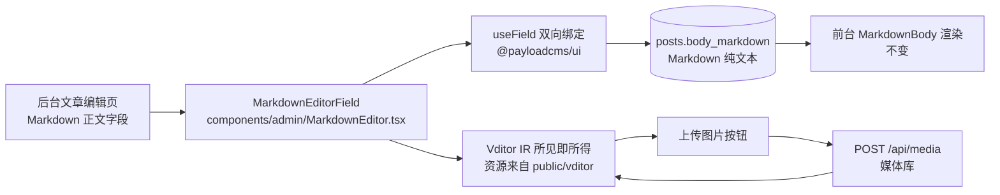

## 产品概述

为后台文章编辑器提供 **Markdown 可视化（所见即所得）写作体验**：把当前「Markdown 正文」的纯文本输入框替换为 Vditor 即时渲染编辑器，输入 `#` 即成为标题、所见即所得，工具栏提供常用排版操作，图片可从本地选图上传到本站媒体库并自动插入 Markdown 语法，也支持直接粘贴外链图片地址。

## 核心功能

- 「Markdown 正文」字段改为所见即所得编辑器（IR 即时渲染模式），带工具栏：标题、粗体、斜体、删除线、引用、无序/有序列表、任务列表、代码块、行内代码、链接、表格、分割线、上传图片、撤销/重做、全屏
- 编辑内容仍以 **Markdown 纯文本**保存，字段校验、阅读时长与摘要自动计算、前台渲染优先级全部不变
- 工具栏「上传图片」按钮选择本地图片后上传到本站媒体库，成功后自动插入 ``；上传失败在编辑器内以中文提示，不插入无效链接
- 可直接粘贴或手写外链图片 ``，前台经站内懒加载组件渲染
- 编辑器样式适配站点深紫控制台主题，不使用红色；配色仅作用于编辑器容器内，不污染后台其它区域
- 编辑器的运行时资源（高亮主题、图标等）由本站自托管，不依赖外部 CDN，符合自托管部署方式
- 兼容与降级：字段只读时显示只读文本；编辑器脚本加载失败时自动回退为可用的纯文本输入框，不阻断写作

## 使用方式（交付后）

后台文章编辑页 → 在「Markdown 正文」区域直接书写：输入 `# ` 得到标题、选中文字点工具栏加粗、点「上传图片」选本地图片即自动上传并插入、也可粘贴外链图片地址 → 保存或发布。原有富文本正文与前台展示均不受影响。

## 技术栈选择

沿用项目现状，仅新增一个编辑器依赖：

- 框架与语言：Next.js 16.3.6 App Router、React 19.3.0、TypeScript 5.9、CSS Modules（项目约束：不使用 Tailwind）
- 后台体系：Payload CMS 3.90.2 与 `@payloadcms/ui` 3.90.2（已随 payload 安装，提供 `useField` 值绑定）
- 新增依赖：`vditor`（社区成熟的中文 Markdown 编辑器，支持 IR 即时渲染模式；按用户选择接受其体积代价）
- 存储与前台：**完全不改**——仍为 `posts.bodyMarkdown` 纯文本，前台仍由 `components/MarkdownBody.tsx` 渲染
- 资源自托管：`public/vditor`（由脚本从 `node_modules/vditor/dist` 同步），组件内 `cdn: '/vditor'`，避免依赖 jsdelivr
- 验证：`npm run typecheck`、`npm run dev` 下的编译与静态资源检查

## 实现思路

核心策略是**只替换字段的输入控件，不动数据与渲染链路**：Payload 支持字段级自定义组件（`admin.components.Field`），组件通过 `useField` 与表单状态双向绑定，因此 Markdown 文本仍是唯一事实来源。

1. **资源自托管（前置）**：新增 `scripts/sync-vditor-assets.mjs`，把 `node_modules/vditor/dist` 递归复制到 `public/vditor`（幂等，已存在则跳过或覆盖，耗时以秒计），接线为 `predev` 与 `prebuild` npm 脚本保证任何启动方式都先同步；`public/vditor/` 加入 `.gitignore`（数 MB 静态资源不入库，克隆后由脚本生成）。
2. **编辑器组件**：新增 `components/admin/MarkdownEditor.tsx`（`'use client'`）。Vditor 只能在浏览器运行，故在 `useEffect` 中动态 `import('vditor')`（独立 chunk，仅后台加载），卸载时 `destroy()`；用 `useField<string>({ path })` 取 `value` 与 `setValue`，初始化用当前值，`input`/`blur` 回调里 `getValue()` 回写；用 `useEffect` 比较外部值与编辑器值，处理草稿恢复/表单重置导致的外部变更。
3. **图片上传**：配置 Vditor 的 `upload.handler`。组装 `FormData`（`file` + `alt`，`alt` 取文件名，因为媒体库 `alt` 为必填），同源 `POST /api/media`（`credentials: 'include'`，依赖管理员 Cookie 会话），成功后取响应中的 `doc.url` 拼成 ``；返回 Vditor 约定的 `{ msg, code, data: { errFiles, succMap } }`。上传前按媒体库允许的类型（jpeg/png/webp/avif）预校验，非图片或超限直接进 `errFiles` 并给出中文提示，避免服务端报错信息难以理解。
4. **降级与只读**：动态导入失败时渲染绑定同一字段的 `textarea`（带说明提示），编辑器不可用不阻断写作；`readOnly` 时直接渲染只读文本，不加载 Vditor。
5. **字段接线与生成物**：`payload.config.ts` 的 `bodyMarkdown` 保留 label 与 description，新增 `admin.components.Field = '/components/admin/MarkdownEditor#MarkdownEditorField'`（路径相对 `importMap.baseDir` 即项目根）；执行 `npx payload generate:importmap` 刷新 `app/(payload)/admin/importMap.js` 并确认新增条目存在，否则后台会渲染不出组件。
6. **样式适配**：引入 `vditor/dist/index.css`，再用 `components/admin/MarkdownEditor.module.css` 在编辑器容器内覆盖为站点深色配色（面板/边框/工具栏/选区/链接/代码块/表格），复用 `:root` 变量，代码高亮沿用信号黄 / EVA 紫 / 银铬且**不使用红色**（含错误提示色改为信号黄/紫）；样式一律以容器类为前缀，避免影响 Payload 后台其它区块。

### 关键决策与理由

- **选 Vditor 的 IR 模式**：用户明确选择"所见即所得（Vditor）"；IR 模式即 Typora 式即时渲染，满足"输入 `#` 就是标题"的预期。
- **自托管而非 CDN**：Vditor 默认从 jsdelivr 按需加载高亮主题等资源；本项目为自托管部署（README 要求 Nginx + 持久化目录），外链 CDN 会在内网/断网环境导致编辑器降级或样式缺失，故随仓库外的脚本同步到 `public/`。
- **不引入 `rehype-raw`、不放宽 HTML**：与既有前台策略一致；编辑器输出仍是 Markdown 文本，XSS 面不变。
- **上传走 Payload REST 而非自建接口**：复用媒体库既有的类型限制、图片尺寸生成与访问控制（`access.create = adminOnly`），避免第二套上传逻辑与鉴权分支。
- **不替换富文本编辑器**：两种正文并存是既定设计，本次只增强 Markdown 一侧，回归面最小。

### 性能与可靠性

- Vditor 通过动态 `import()` 只进入后台管理端 chunk，**不影响前台公开页面的包体积与首屏**；编辑器懒加载发生在字段进入视口/挂载后。
- 资源同步脚本为一次性文件复制，幂等；`.gitignore` 排除生成物，仓库体积不膨胀。
- 上传为单请求串行处理多文件，失败文件单独回传 `errFiles`，不整批丢弃；请求前做类型/大小预校验，减少无效往返。
- 边界处理：字段为空时不写入空字符串；外部值变化时同步编辑器；编辑器销毁时清空实例引用避免内存泄漏；`destroy()` 在组件卸载与热更新重挂载时都调用。

## 架构设计

维持既有分层，仅替换后台字段的展示/输入组件，数据流与前台渲染链路不变：



## 实现注意

- 必须先执行资源同步脚本，否则编辑器会尝试从外部 CDN 取资源或缺失样式；`predev`/`prebuild` 接线用于自动化这一步。
- 字段组件路径与导出名必须与 importMap 一致（`/components/admin/MarkdownEditor#MarkdownEditorField`），改完务必重新生成 importMap 并确认 `app/(payload)/admin/importMap.js` 中出现该条目。
- Vditor 实例必须在卸载时 `destroy()`；React 严格模式下 `useEffect` 会执行两次，需在清理函数中避免重复初始化导致的 DOM 残留。
- 与 Payload 表单的同步要防抖（编辑器 `input` 事件高频），避免每次按键都触发整个表单校验；`blur` 时再确保一次同步。
- 若 webpack 解析 `vditor` 构图报错，兜底方案是在 `next.config.ts` 增加 `transpilePackages: ['vditor']`；先不加，按实际情况处理。
- 不改动 `bodyMarkdown` 的字段类型（仍是 textarea → varchar）、校验逻辑与前台渲染分支，因此**不需要数据库迁移**。
- 完成后按项目惯例更新 `changlog.md`（顶部追加）与 README 的后台写作说明，并运行 `npm run typecheck`（用户此前取消过 `npm run build`，不主动运行）。

## 目录结构

```
oldtech/
├── package.json                                    # [MODIFY] 新增依赖 vditor；新增 predev/prebuild 脚本调用资源同步脚本
├── .gitignore                                      # [MODIFY] 新增 public/vditor/（生成物，不入库）
├── scripts/
│   └── sync-vditor-assets.mjs                      # [NEW] 将 node_modules/vditor/dist 同步到 public/vditor，幂等且带日志输出；供 predev/prebuild 调用
├── components/admin/
│   ├── MarkdownEditor.tsx                          # [NEW] 'use client' 字段组件：导出 MarkdownEditorField；动态 import vditor，IR 模式与暗色主题；useField 双向绑定（初始化值、input/blur 回写、外部值变化同步）；upload.handler 上传到 /api/media 并回填 ；动态导入失败回退 textarea；readOnly 渲染只读文本；卸载 destroy()
│   └── MarkdownEditor.module.css                   # [NEW] 容器作用域下的深色控制台样式覆盖（面板/边框/工具栏/选区/链接/代码高亮/表格），复用 :root 变量，不使用红色
├── payload.config.ts                               # [MODIFY] bodyMarkdown 字段 admin.components.Field 指向自定义组件，保留 label 与 description
├── app/(payload)/admin/importMap.js                # [MODIFY] 由 npx payload generate:importmap 生成，新增自定义字段组件映射
├── public/vditor/                                  # [NEW] 自托管编辑器资源（脚本生成，git 忽略）
├── README.md                                       # [MODIFY] 补充后台 Markdown 可视化编辑说明、资源同步脚本与新依赖
└── changlog.md                                     # [MODIFY] 顶部追加条目：Markdown 字段升级为所见即所得、图片上传到媒体库、资源自托管与降级策略
```

## 关键代码结构

字段接线（`payload.config.ts`）：

```ts
{
  name: 'bodyMarkdown',
  label: 'Markdown 正文',
  type: 'textarea',
  admin: {
    description: '与富文本正文二选一；填写后前台优先渲染 Markdown。',
    components: { Field: '/components/admin/MarkdownEditor#MarkdownEditorField' },
  },
}
```

上传处理器返回约定（`components/admin/MarkdownEditor.tsx`，Vditor 要求的形态）：

```ts
type VditorUploadResult = {
  msg: string;
  code: 0 | 1;
  data: { errFiles: string[]; succMap: Record<string, string> };
};
// succMap 的 value 为 /api/media 响应中的 doc.url，用于生成 
```

## Agent Extensions

### Skill

- **playwright-cli**
- Purpose: 在实现完成后驱动浏览器验证后台可用性——打开 `/admin` 与文章编辑页，确认自定义字段组件被正确加载、Vditor 资源（`/vditor/dist/index.css` 等）返回 200、编辑器容器渲染为深色主题且无控制台报错；并截取不同宽度（桌面 / 窄屏）的截图核对工具栏折行与无横向溢出。
- Expected outcome: 得到可核对的截图与控制台/网络检查结论，确认后台未出现编译或运行时错误、资源自托管生效；登录后的实际输入与上传行为交由用户实测（环境内无管理员凭据）。

### SubAgent

- **code-explorer**
- Purpose: 在动手前快速核对三个改动点的现状——`bodyMarkdown` 字段定义与 `admin` 配置（`payload.config.ts`）、`app/(payload)/admin/importMap.js` 的条目格式、以及 `package.json` 现有脚本与 `next.config.ts` 配置，确保字段路径、导出名与脚本接线方式与现有约定一致。
- Expected outcome: 输出字段与生成物的精确位置与格式结论，使 `components.Field` 路径、importMap 重新生成步骤和 npm 脚本接线一次到位，避免后台渲染不出组件。